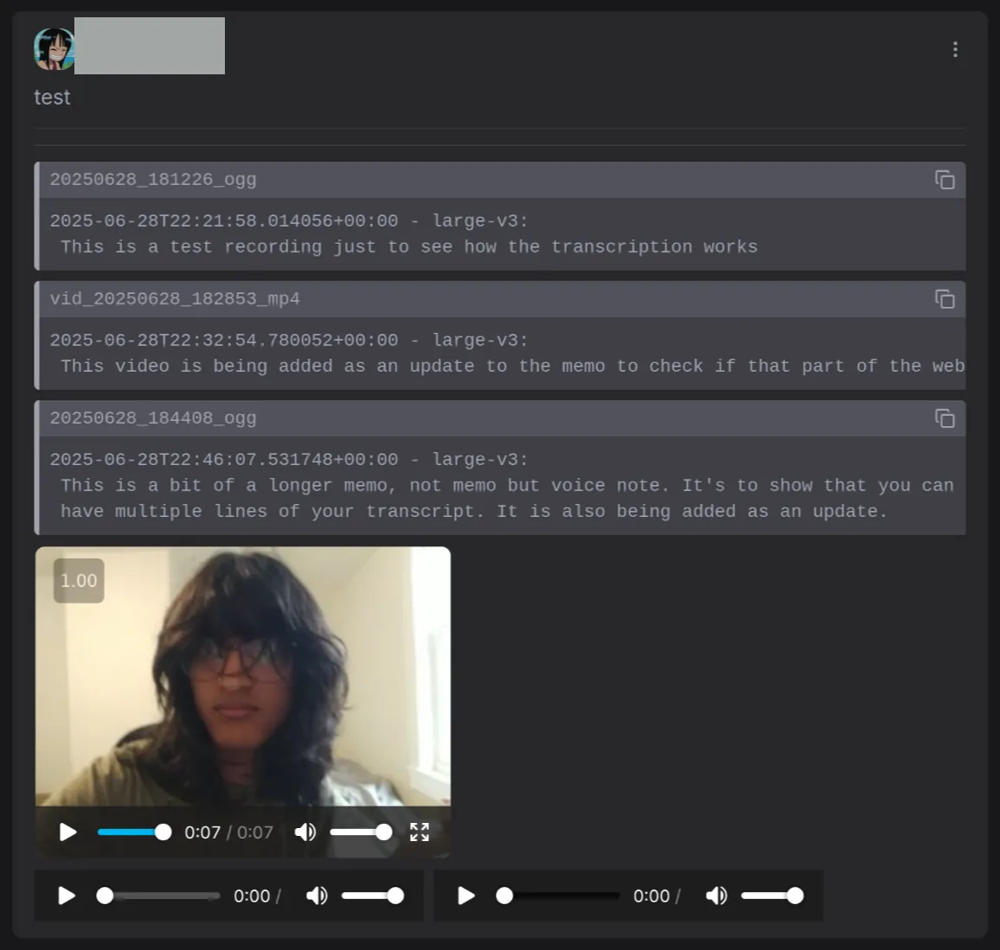

# memo transcriber
currently a pretty barebones mvp. works with a webhook on port 5000 with a function to transcribe all memos which meet requirements if you want. probably a lot of bugs and typos

adds transcripts like this:

## usage
### docker
1. clone and cd into repo
2. `cp .env.example .env`
3. edit variables in .env
4. `docker compose up -d` (maybe `docker-compose up -d` depending on distro (debian))
5. add webhook

### native
1. fill all the variables in the code/env, modify the filters and stuff
2. get all requirements (ive only tried the nix stuff)
3. run `python main.py`
4. add the webhook to your memos instance

### optional
- run `do_all()` if u want, this is still pretty rough. there will be a better way eventually

## motivation
be able to see what i log without having to download the whole video/audio file which can be several gigabytes. also searchability

## TODO
- [ ] figure out a better name for this (super important, obviously)
- [ ] make the code not a disaster
  - [ ] env vars instead of hardcoded
  - [ ] figure out unloading the model in downtime
  - [ ] package properly
  - [ ] error handling
  - [ ] more robust filtering of which memos should be transcribed
  - [ ] figure out where to store model in docker image
- [X] docker image
- [ ] barebones webui
- [ ] add option for external transcription
